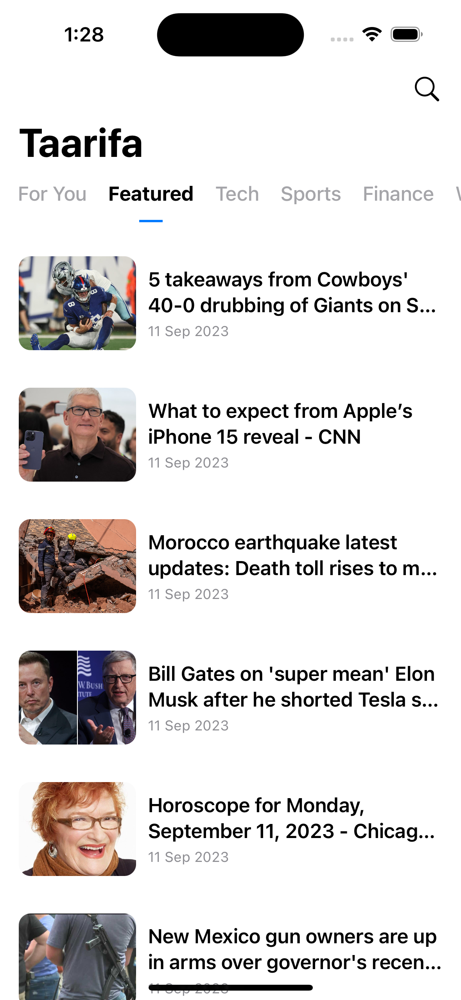
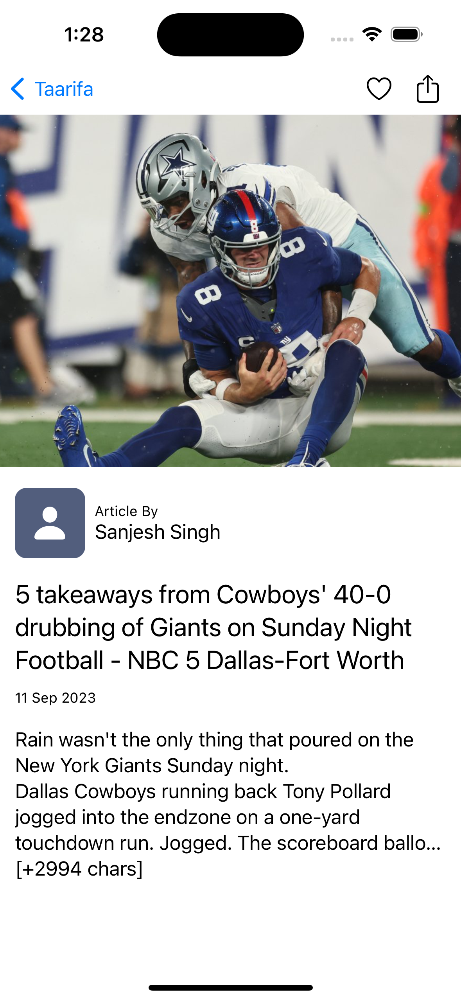
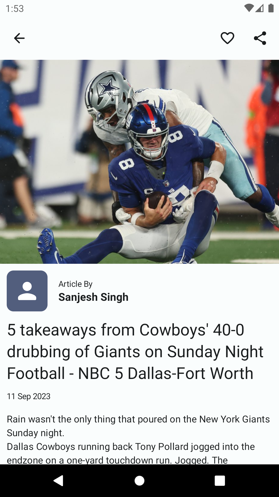
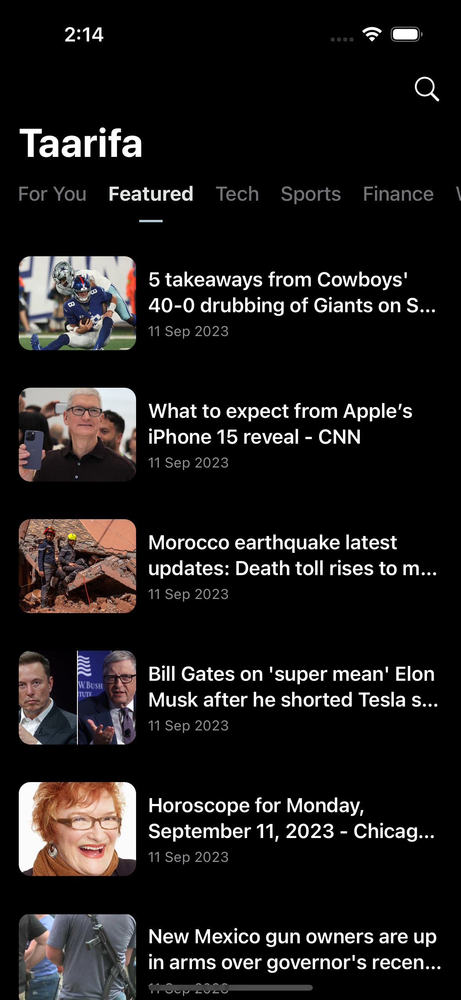
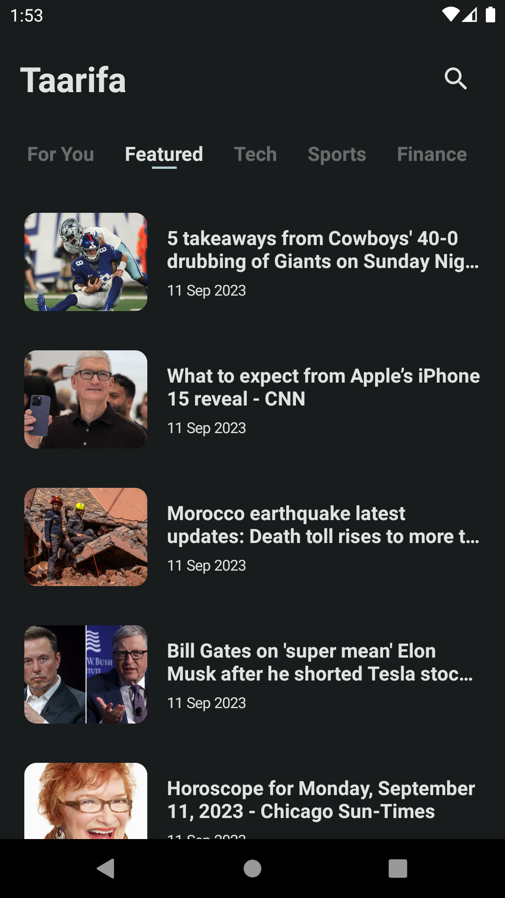
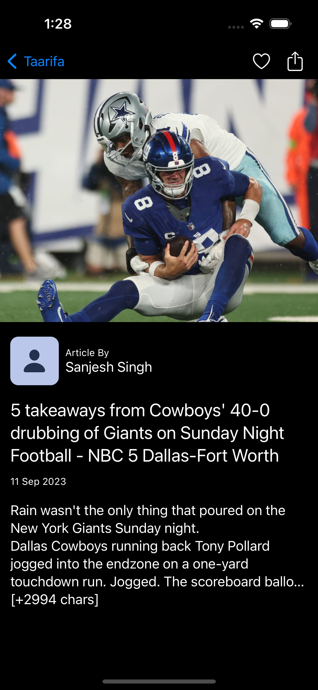

# Taarifa

A [KMP](https://kotlinlang.org/docs/multiplatform.html) news app based on (News API)(https://newsapi.org/docs/endpoints/top-headlines) that displays trending news.
The app runs on:
- iOS (SwiftUI)
- Android (Jetpack Compose)

## Core Libraries
- (Kotlin MultiPlatform)[https://kotlinlang.org/docs/multiplatform.html]
- (Jetpack Compose)[https://developer.android.com/jetpack/compose]
- (Swift UI)[https://developer.apple.com/xcode/swiftui/]
- (Coroutines)[https://kotlinlang.org/docs/coroutines-overview.html]
- (Koin)[https://insert-koin.io/]
- (SQLDelight)[https://github.com/cashapp/sqldelight]
- (Ktor)[https://ktor.io/]
- (Build Konfig)[https://github.com/yshrsmz/BuildKonfig]
- (KMP-NativeCoroutines)[https://github.com/rickclephas/KMP-NativeCoroutines]

## Building & Running
- Clone this repository
```shell
git clone https://github.com/tirgei/Taarifa.git
```

- Setup the `local.properties` in the root project directory with the following:
```shell
NEWS_BASE_URL=newsapi.org
NEWS_API_KEY=<YOUR_NEWS_API_KEY>
```

- Run the application

## ScreenShots

### Light Theme

| ** iOS Home **                                 | ** Android Home **                                 |
|------------------------------------------------|----------------------------------------------------|
|  |  |


| ** iOS Details **                                 | ** Android Details **                                 |
|---------------------------------------------------|-------------------------------------------------------|
|  |  |


### Dark Theme

| ** iOS Home **                                | ** Android Home **                                |
|-----------------------------------------------|---------------------------------------------------|
|  |  |


| ** iOS Details **                                | ** Android Details **                                |
|--------------------------------------------------|------------------------------------------------------|
|  |  |

